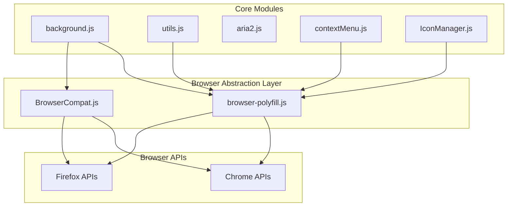
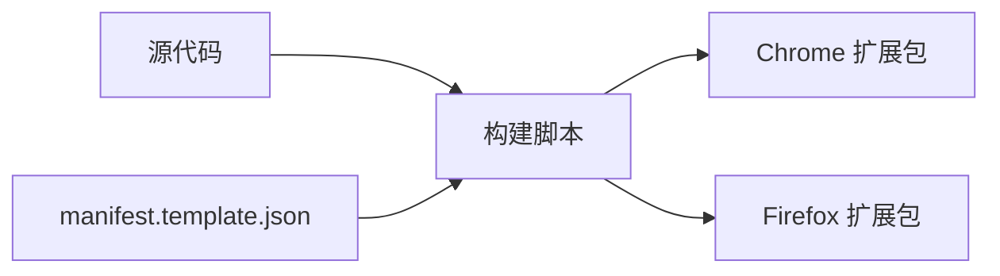

# Design Document: Firefox Compatibility

## Overview

本设计文档描述了将 Aria2-Explorer Chrome 扩展适配为同时支持 Firefox 浏览器的技术方案。核心策略是创建一个浏览器抽象层（Browser Abstraction Layer），使代码能够在两个浏览器中运行，同时对不支持的功能提供优雅降级。

### 设计原则

1. **最小侵入性**: 尽量保持现有代码结构，通过抽象层处理差异
2. **渐进增强**: 核心功能在所有浏览器中可用，高级功能按浏览器能力启用
3. **单一代码库**: 使用条件逻辑和 polyfill，避免维护多个代码分支
4. **构建时分离**: 仅 manifest.json 在构建时生成浏览器特定版本

## Architecture



### 构建流程



## Components and Interfaces

### 1. Browser Polyfill 模块

使用 Mozilla 的 `webextension-polyfill` 库统一 API 调用。

```javascript
// js/browser-polyfill.js (引入第三方库)
// 该库将 chrome.* API 包装为返回 Promise 的 browser.* API
// Firefox 原生支持 browser.* API，Chrome 通过 polyfill 支持
```

### 2. BrowserCompat 模块

处理无法通过 polyfill 解决的浏览器差异。

```javascript
// js/browserCompat.js
class BrowserCompat {
    static isFirefox = typeof browser !== 'undefined' && 
                       browser.runtime?.getBrowserInfo !== undefined;
    
    static isChrome = !BrowserCompat.isFirefox;
    
    // 检测 API 可用性
    static hasAPI(apiPath) {
        const parts = apiPath.split('.');
        let obj = typeof browser !== 'undefined' ? browser : chrome;
        for (const part of parts) {
            if (obj && typeof obj[part] !== 'undefined') {
                obj = obj[part];
            } else {
                return false;
            }
        }
        return true;
    }
    
    // Side Panel 支持检测
    static get supportsSidePanel() {
        return BrowserCompat.isChrome && BrowserCompat.hasAPI('sidePanel');
    }
    
    // Power API 支持检测
    static get supportsPowerAPI() {
        return BrowserCompat.hasAPI('power');
    }
    
    // System Display API 支持检测
    static get supportsSystemDisplay() {
        return BrowserCompat.hasAPI('system.display');
    }
    
    // downloads.onDeterminingFilename 支持检测
    static get supportsOnDeterminingFilename() {
        return BrowserCompat.hasAPI('downloads.onDeterminingFilename');
    }
    
    // 获取屏幕尺寸（跨浏览器）
    static async getScreenSize() {
        if (BrowserCompat.supportsSystemDisplay) {
            const displays = await chrome.system.display.getInfo();
            return displays[0].workArea;
        }
        // Firefox 降级方案
        return {
            width: window.screen.availWidth,
            height: window.screen.availHeight,
            left: 0,
            top: 0
        };
    }
    
    // 电源管理（跨浏览器）
    static requestKeepAwake(level) {
        if (BrowserCompat.supportsPowerAPI) {
            chrome.power.requestKeepAwake(level);
        }
        // Firefox: 静默忽略
    }
    
    static releaseKeepAwake() {
        if (BrowserCompat.supportsPowerAPI) {
            chrome.power.releaseKeepAwake();
        }
        // Firefox: 静默忽略
    }
    
    // 获取平台信息
    static async getPlatform() {
        if (navigator.userAgentData?.platform) {
            return navigator.userAgentData.platform;
        }
        // Firefox 降级
        const platformInfo = await browser.runtime.getPlatformInfo();
        const osMap = { 'win': 'Windows', 'mac': 'macOS', 'linux': 'Linux' };
        return osMap[platformInfo.os] || platformInfo.os;
    }
}

export default BrowserCompat;
```

### 3. 下载捕获适配器

处理 `downloads.onDeterminingFilename` 的兼容性问题。

```javascript
// js/downloadCapture.js
class DownloadCapture {
    #captureCallback = null;
    #isListening = false;
    
    constructor() {
        this.useOnDeterminingFilename = BrowserCompat.supportsOnDeterminingFilename;
    }
    
    // 统一的下载捕获接口
    startCapture(callback) {
        this.#captureCallback = callback;
        
        if (this.useOnDeterminingFilename) {
            // Chrome: 使用 onDeterminingFilename 获取完整文件名
            chrome.downloads.onDeterminingFilename.addListener(
                this.#handleDeterminingFilename.bind(this)
            );
        } else {
            // Firefox: 使用 onCreated 作为替代
            browser.downloads.onCreated.addListener(
                this.#handleDownloadCreated.bind(this)
            );
        }
        this.#isListening = true;
    }
    
    stopCapture() {
        if (this.useOnDeterminingFilename) {
            chrome.downloads.onDeterminingFilename.removeListener(
                this.#handleDeterminingFilename.bind(this)
            );
        } else {
            browser.downloads.onCreated.removeListener(
                this.#handleDownloadCreated.bind(this)
            );
        }
        this.#isListening = false;
    }
    
    get isListening() {
        return this.#isListening;
    }
    
    #handleDeterminingFilename(downloadItem, suggest) {
        // Chrome 实现：可以获取建议的文件名
        suggest(); // 必须调用
        if (this.#captureCallback) {
            this.#captureCallback(downloadItem);
        }
    }
    
    async #handleDownloadCreated(downloadItem) {
        // Firefox 实现：需要额外查询获取完整信息
        if (downloadItem.state === 'in_progress') {
            // 获取更多下载信息
            const items = await browser.downloads.search({ id: downloadItem.id });
            if (items.length > 0) {
                const fullItem = items[0];
                if (this.#captureCallback) {
                    this.#captureCallback(fullItem);
                }
            }
        }
    }
}

export default DownloadCapture;
```

### 4. Side Panel 适配器

为 Firefox 提供 Side Panel 的替代方案。

```javascript
// js/sidePanelCompat.js
class SidePanelCompat {
    static async open(options) {
        if (BrowserCompat.supportsSidePanel) {
            return chrome.sidePanel.open(options);
        }
        // Firefox: 使用新标签页替代
        const url = chrome.runtime.getURL('ui/ariang/index.html');
        return browser.tabs.create({ url });
    }
    
    static async setOptions(options) {
        if (BrowserCompat.supportsSidePanel) {
            return chrome.sidePanel.setOptions(options);
        }
        // Firefox: 无操作
        return Promise.resolve();
    }
    
    static async getOptions(options) {
        if (BrowserCompat.supportsSidePanel) {
            return chrome.sidePanel.getOptions(options);
        }
        // Firefox: 返回默认值
        return { path: 'ui/ariang/index.html' };
    }
    
    static async setPanelBehavior(behavior) {
        if (BrowserCompat.supportsSidePanel) {
            return chrome.sidePanel.setPanelBehavior(behavior);
        }
        // Firefox: 无操作
        return Promise.resolve();
    }
}

export default SidePanelCompat;
```

### 5. Manifest 生成器

构建时生成浏览器特定的 manifest.json。

```javascript
// build/manifest-generator.js
const baseManifest = {
    "name": "__MSG_appName__",
    "short_name": "A2E",
    "version": "2.7.7",
    "manifest_version": 3,
    "default_locale": "en",
    "description": "__MSG_description__",
    "homepage_url": "https://aria2e.com",
    "options_page": "options.html",
    "icons": {
        "16": "images/logo16.png",
        "32": "images/logo32.png",
        "48": "images/logo48.png",
        "128": "images/logo128.png"
    },
    "action": {
        "default_icon": {
            "16": "images/logo16.png",
            "32": "images/logo32.png",
            "48": "images/logo48.png"
        },
        "default_title": "__MSG_appName__"
    },
    "commands": {
        "toggle-capture": {
            "suggested_key": { "default": "Alt+A" },
            "description": "__MSG_toggleCapture__"
        },
        "launch-aria2": {
            "suggested_key": { "default": "Alt+X" },
            "description": "__MSG_startAria2Str__"
        }
    },
    "web_accessible_resources": [{
        "resources": ["js/magnet.js", "magnet.html", "ui/ariang/logo512m.png"],
        "matches": ["<all_urls>"]
    }]
};

function generateChromeManifest() {
    return {
        ...baseManifest,
        "minimum_chrome_version": "116.0.0",
        "permissions": [
            "cookies", "tabs", "notifications", "contextMenus",
            "downloads", "storage", "system.display", "scripting",
            "sidePanel", "power"
        ],
        "host_permissions": ["<all_urls>"],
        "background": {
            "service_worker": "background.js",
            "type": "module"
        },
        "incognito": "split",
        "side_panel": {
            "default_path": "ui/ariang/index.html"
        },
        "content_security_policy": {
            "extension_pages": "script-src 'self';object-src 'self';frame-src 'self' aria2://* https://*.aria2e.com/;"
        },
        "externally_connectable": { "ids": ["*"] }
    };
}

function generateFirefoxManifest() {
    return {
        ...baseManifest,
        "browser_specific_settings": {
            "gecko": {
                "id": "aria2-explorer@example.com",
                "strict_min_version": "109.0"
            }
        },
        "permissions": [
            "cookies", "tabs", "notifications", "contextMenus",
            "downloads", "storage", "scripting"
        ],
        "host_permissions": ["<all_urls>"],
        "background": {
            "scripts": ["js/browser-polyfill.min.js", "background.js"],
            "type": "module"
        },
        "incognito": "spanning",
        "content_security_policy": {
            "extension_pages": "script-src 'self';object-src 'self';"
        }
    };
}
```

## Data Models

### 配置数据模型

配置数据在两个浏览器中保持一致，但需要处理浏览器特定选项的默认值。

```typescript
interface ExtensionConfig {
    // 通用配置
    contextMenus: boolean;
    askBeforeExport: boolean;
    exportAll: boolean;
    integration: boolean;
    fileSize: string;
    checkClick: boolean;
    askBeforeDownload: boolean;
    allowExternalRequest: boolean;
    monitorAria2: boolean;
    monitorAll: boolean;
    badgeText: boolean;
    allowNotification: boolean;
    keepSilent: boolean;
    captureMagnet: boolean;
    remindCaptureTip: boolean;
    rpcList: RpcItem[];
    allowedSites: string[];
    blockedSites: string[];
    allowedExts: string[];
    blockedExts: string[];
    
    // 浏览器特定配置（需要条件处理）
    webUIOpenStyle: 'window' | 'popup' | 'tab' | 'sidePanel';
    keepAwake: boolean;  // 仅 Chrome 有效
    iconOffStyle: 'Dusk' | 'Dark' | 'Grey';
    colorModeId: number;
}

interface RpcItem {
    name: string;
    url: string;
    location: string;
    pattern: string;
}
```

### 下载项数据模型

```typescript
interface DownloadItem {
    url: string;
    filename: string;
    dir?: string;
    referrer?: string;
    options?: Record<string, any>;
    multiTask?: boolean;
    type?: 'DOWNLOAD_VIA_BROWSER';
    // Firefox 特有字段
    id?: number;
    state?: string;
    finalUrl?: string;
    byExtensionId?: string;
}
```

## Correctness Properties

*A property is a characteristic or behavior that should hold true across all valid executions of a system-essentially, a formal statement about what the system should do. Properties serve as the bridge between human-readable specifications and machine-verifiable correctness guarantees.*


### Property 1: Manifest 生成正确性

*For any* 目标浏览器（Chrome 或 Firefox），生成的 manifest.json 应该：
- Chrome 版本包含 `service_worker` 配置和 Chrome 特有权限（sidePanel, system.display, power）
- Firefox 版本包含 `browser_specific_settings`、`background.scripts` 配置，且不包含 Chrome 特有权限

**Validates: Requirements 1.1, 1.2, 1.3, 1.5**

### Property 2: API 可用性检测正确性

*For any* 浏览器环境，BrowserCompat 模块的 API 检测方法应该：
- 在 Chrome 环境中，`supportsSidePanel`、`supportsPowerAPI`、`supportsSystemDisplay` 返回 true
- 在 Firefox 环境中，这些方法返回 false
- `hasAPI()` 方法对存在的 API 路径返回 true，对不存在的返回 false

**Validates: Requirements 2.1, 2.4, 10.1, 11.1, 12.1**

### Property 3: 下载捕获回退机制正确性

*For any* 浏览器环境，DownloadCapture 模块应该：
- 在支持 `onDeterminingFilename` 的环境中使用该事件
- 在不支持的环境中自动回退到 `onCreated` 事件
- 两种模式下都能正确调用回调函数处理下载项

**Validates: Requirements 3.2, 3.4**

### Property 4: 功能降级行为正确性

*For any* 不支持特定 API 的浏览器环境：
- `SidePanelCompat.open()` 在不支持 Side Panel 时应打开新标签页
- `BrowserCompat.requestKeepAwake()` 在不支持 Power API 时应静默返回而不抛出错误
- `BrowserCompat.getScreenSize()` 在不支持 system.display 时应返回有效的屏幕尺寸对象

**Validates: Requirements 10.2, 11.2, 12.2**

### Property 5: 存储往返一致性

*For any* 有效的配置对象，通过 storage API 保存后再读取，应该返回与原始对象等价的数据。

**Validates: Requirements 5.1, 5.2**

### Property 6: 构建系统双版本生成

*For any* 构建执行，构建系统应该生成两个独立的扩展包，分别包含正确的 Chrome 和 Firefox manifest 配置。

**Validates: Requirements 14.1**

### Property 7: 通知按钮适配

*For any* 通知创建请求，如果浏览器不支持通知按钮，通知应该在不包含按钮的情况下正常创建。

**Validates: Requirements 6.2**

### Property 8: 内容脚本注册检测

*For any* 内容脚本注册请求，BrowserCompat 应该正确检测 `scripting.registerContentScripts` API 的可用性。

**Validates: Requirements 8.2**

## Error Handling

### 1. API 不可用错误处理

```javascript
// 统一的 API 调用包装器
async function safeAPICall(apiPath, fallback, ...args) {
    try {
        if (BrowserCompat.hasAPI(apiPath)) {
            const parts = apiPath.split('.');
            let obj = typeof browser !== 'undefined' ? browser : chrome;
            for (const part of parts.slice(0, -1)) {
                obj = obj[part];
            }
            const method = parts[parts.length - 1];
            return await obj[method](...args);
        }
        return fallback ? fallback(...args) : undefined;
    } catch (error) {
        console.warn(`API call failed: ${apiPath}`, error);
        return fallback ? fallback(...args) : undefined;
    }
}
```

### 2. 下载捕获错误处理

- 如果下载取消失败，记录警告但不中断流程
- 如果 aria2 连接失败，在 Firefox 中同样回退到浏览器下载

### 3. 存储错误处理

- 存储操作失败时使用默认配置
- 记录错误日志以便调试

### 4. 通知错误处理

- 通知创建失败时静默处理
- 不影响核心下载功能

## Testing Strategy

### 单元测试

使用 Jest 或 Vitest 进行单元测试：

1. **BrowserCompat 模块测试**
   - 测试 API 检测方法在模拟环境下的行为
   - 测试降级方法的返回值

2. **Manifest 生成器测试**
   - 验证 Chrome manifest 包含正确字段
   - 验证 Firefox manifest 包含正确字段
   - 验证两者的差异符合预期

3. **DownloadCapture 模块测试**
   - 测试事件监听器选择逻辑
   - 测试回调函数调用

4. **SidePanelCompat 模块测试**
   - 测试在不同环境下的行为

### 属性测试

使用 fast-check 进行属性测试：

1. **Manifest 生成属性测试**
   - 生成随机配置，验证输出 manifest 的结构正确性

2. **存储往返属性测试**
   - 生成随机配置对象，验证存储后读取的一致性

### 集成测试

使用 Playwright 或 Puppeteer 进行浏览器集成测试：

1. **Chrome 环境测试**
   - 验证扩展在 Chrome 中正常加载
   - 验证下载捕获功能
   - 验证 Side Panel 功能

2. **Firefox 环境测试**
   - 验证扩展在 Firefox 中正常加载
   - 验证下载捕获功能（使用 onCreated）
   - 验证 Side Panel 降级为标签页

### 测试配置

```javascript
// vitest.config.js
export default {
    test: {
        environment: 'jsdom',
        globals: true,
        coverage: {
            provider: 'v8',
            reporter: ['text', 'json', 'html']
        }
    }
};
```

### 属性测试示例

```javascript
// tests/browserCompat.property.test.js
import { fc } from 'fast-check';
import BrowserCompat from '../js/browserCompat.js';

describe('BrowserCompat Properties', () => {
    // Feature: firefox-compatibility, Property 2: API 可用性检测正确性
    test('hasAPI returns boolean for any valid API path', () => {
        fc.assert(
            fc.property(
                fc.array(fc.string({ minLength: 1, maxLength: 20 }), { minLength: 1, maxLength: 5 }),
                (pathParts) => {
                    const apiPath = pathParts.join('.');
                    const result = BrowserCompat.hasAPI(apiPath);
                    return typeof result === 'boolean';
                }
            ),
            { numRuns: 100 }
        );
    });
});
```
